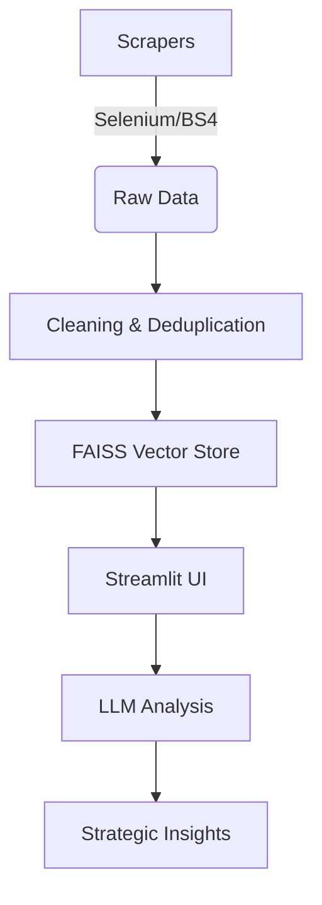

# 🛠 GenAI Market Intelligence Dashboard


*A data-driven platform for tracking Generative AI initiatives, competitor analysis, and partnership opportunities for Dell*

)

## 📌 Overview

This project automates the collection and analysis of **Generative AI (GenAI)** initiatives from **7 major IT companies** (TCS, Infosys, Wipro, LTIMindtree, HCLTech, Tech Mahindra, and Cognizant) across **India and Australia**, providing Dell with actionable insights on:

✅ **Competitor AI investments**  
✅ **Emerging market trends**  
✅ **Potential partnership opportunities**  
✅ **Talent acquisition strategies**  

Built with **Python, Selenium, LangChain, and Streamlit**, it combines **web scraping, NLP, and LLM-powered analytics** into an interactive dashboard.

## ✨ Key Features

| Feature                          | Tech Used                     | Impact |
|----------------------------------|-------------------------------|--------|
| Automated Job & News Scraping    | Selenium, BeautifulSoup, SerpAPI | Collected 1,500+ job listings & 300+ news articles |
| Multi-threaded Scraping          | ThreadPoolExecutor, User-Agent Rotation | 40% faster data collection with fewer blocks |
| NLP Preprocessing                | NLTK, Regex, Lemmatization    | Cleaned text for accurate embeddings |
| Semantic Search (RAG)            | HuggingFace (MiniLM-L6-v2), FAISS | Real-time retrieval of relevant insights |
| LLM-Powered Analysis             | LLaMA 3.3-70B (Groq), LangChain | Strategic recommendations with citations |
| Interactive Dashboard            | Streamlit                     | User-friendly filtering by company/region |

## 🚀 Pipeline Architecture



## 1. Data Acquisition
- Job postings from Seek.com.au and Google Jobs
- AI articles from company blogs and news sites
- Anti-blocking measures (user-agent rotation, request throttling)

## 2. Data Processing
- Company name standardization
- Text cleaning (lemmatization, stopword removal)
- Dataset merging with deduplication

## 3. AI & Analytics
- Embeddings: HuggingFace's MiniLM-L6-v2
- Vector DB: FAISS for fast semantic search
- LLM: LLaMA 3.3-70B via Groq API

## 4. Dashboard
- Filter by: Company, Region, Analysis Type
- Outputs: Executive summaries + actionable recommendations

## 📂 Repository Structure
```
GenAI-Market-Intelligence/
├── data/ # Processed datasets (CSVs)
├── scrapers/ # Web scraping scripts
│ ├── seek_jobs_scraper.py
│ ├── google_jobs_scraper.py
│ ├── webpage_scraper.py
│ └── google_news_scraper.py
├── utils.py # NLP preprocessing
├── app.py # Streamlit dashboard
├── requirements.txt # Python dependencies
├── .env.example # Environment variables template
├── LICENSE # MIT License
└── README.md # Project documentation
```

---
## 🛠 Setup & Usage

### Prerequisites
- Python 3.9+
- [SERPAPI](https://serpapi.com/) account (for Google Jobs)
- [Groq](https://groq.com/) API key (for LLaMA 3)

### Installation
1. Clone the repository:
   ```bash
   git clone https://github.com/yourusername/GenAI-Market-Intelligence.git
   cd GenAI-Market-Intelligence
   ```

2. Install dependencies
```bash
pip install -r requirements.txt
```
3. Configure Environment Variables
```bash
cp .env.example .env
```
4. Add your API keys to `.env`:
```
env
SERPAPI_KEY=your_key_here
GROQ_API_KEY=your_key_here
```
### Running the Dashboard
```bash
streamlit run app.py
```
## 📈 Future Enhancements

- [ ] **Real-time alerts**: Slack/Email notifications for new job trends  
- [ ] **Sentiment analysis**: Track positive/negative news sentiment  
- [ ] **Expanded coverage**: Add 10 more companies and EU region  
- [ ] **Automated reporting**: PDF/PPT generation with Plotly charts  
- [ ] **CI/CD pipeline**: Automated data refreshes via GitHub Actions

## 📜 License

Distributed under the MIT License. See `LICENSE` for more information.
MIT License

Copyright (c) 2024 Your Name

Permission is hereby granted...


